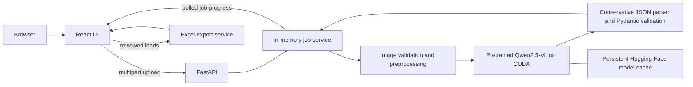

# Business Card Lead Extractor

A full-stack application that converts business-card images into structured,
editable leads and exports the reviewed data to Excel. The extraction backend
uses the pretrained **Qwen2.5-VL-3B-Instruct** vision-language model; no model
training or fine-tuning is performed.

## Submission

| Item | Location |
|---|---|
| Deployed application | [Open the Lightning AI application](https://5173-01m2w98emjfcmws3qnw3cmh05x.cloudspaces.litng.ai) |
| Backend API | [Readiness](https://8000-01m2w98emjfcmws3qnw3cmh05x.cloudspaces.litng.ai/api/ready) · [Interactive API documentation](https://8000-01m2w98emjfcmws3qnw3cmh05x.cloudspaces.litng.ai/docs) |
| Source code | [Ayushman281/Business-Card-Extractor](https://github.com/Ayushman281/Business-Card-Extractor) and the `business-card-lead-extractor-final.zip` source package supplied with the submission |
| Lightning AI deployment | [lightning/README.md](lightning/README.md) |
| AWS full-stack deployment | [aws/README.md](aws/README.md) |
| Architecture details | [docs/architecture.md](docs/architecture.md) |

The GitHub repository is private. Reviewers need repository access or the supplied
source ZIP; the deployed application has a separate public URL.

The current demo runs in a user-operated Lightning AI Studio. Its public URLs
are available only while the Studio and both application processes are running.
I started the model and deployed the application; this final documentation pass
did not independently invoke the hosted model.

## What the application does

1. A user selects up to 20 JPG, PNG, or WEBP business-card images.
2. The browser uploads the batch to FastAPI and receives an asynchronous job ID.
3. Images are validated, EXIF-corrected, converted to RGB, resized, and processed
   sequentially by the pretrained Qwen VLM on an NVIDIA GPU.
4. Model output is parsed and validated into seven nullable fields: first name,
   last name, job title, company, location, phone, and email.
5. The UI displays progress and independent errors for unreadable cards.
6. Users review and edit successful results before downloading a formatted XLSX
   workbook containing their corrected values.

## Features

- Multi-file picker, drag-and-drop, image previews, and client-side limits.
- Real pretrained VLM inference; production routes never return mocked leads.
- Asynchronous batch jobs with progress polling and per-card failure isolation.
- Editable lead table and text-safe Excel export, including leading-zero phone
  numbers and formula-like text.
- File-size, request-size, image-signature, pixel-count, and animation checks.
- Explicit model loading, readiness reporting, and a single GPU worker.
- Runtime frontend API configuration, so moving between Lightning AI and AWS
  does not require changes to React or Python source.
- Hosted setup, non-model tests, real-model smoke scripts, Docker Compose, and
  Nginx reverse-proxy configuration.

## Architecture



The frontend and backend are separate processes on Lightning AI. Each is exposed
through an HTTPS Port Viewer URL; the backend allows only the configured frontend
origin through CORS. On AWS, Nginx serves React and proxies `/api` to FastAPI over
the private Compose network, giving the browser a single public origin.

### Major technical decisions

| Decision | Reason |
|---|---|
| Qwen2.5-VL-3B-Instruct | A compact pretrained VLM capable of reading layouts and text directly from card images. |
| No OCR fallback | Keeps the extraction path consistent and makes model behavior explicit for the assessment. |
| One Uvicorn worker | Prevents duplicate multi-gigabyte model copies and keeps the in-memory job store consistent. |
| Sequential inference | Bounds GPU memory on a 16 GB GPU and isolates errors by card. |
| HTTP 202 job workflow | Allows the UI to report real progress without holding one long upload request open. |
| In-memory jobs with expiry | Appropriate for a small demonstration without adding a database; results expire after 15 minutes. |
| Conservative parsing | Accepts recoverable JSON but never uses `eval` or invents values when output is malformed. |
| Runtime `app-config.json` | Lets one frontend build target Lightning or AWS without embedding a provider URL in source. |
| Explicit cloud target and inference flag | Prevents accidental model downloads or inference during ordinary source inspection. |

## Technology and external components

| Area | Components |
|---|---|
| Frontend | React 19, TypeScript 5.9, Vite 8, Fetch API, plain CSS |
| API | Python 3.11+, FastAPI, Uvicorn, Pydantic, pydantic-settings, python-multipart |
| Model runtime | Qwen2.5-VL-3B-Instruct, Transformers 4.57.6, PyTorch 2.10.0, torchvision 0.25.0, Accelerate 1.15.0, CUDA |
| Image processing | Pillow 12.3.0 |
| Excel | pandas 3.0.5, openpyxl 3.1.5 |
| Deployment | Lightning AI Studio/Port Viewer; Docker Compose and Nginx for AWS |

The default model revision is pinned to
`66285546d2b821cf421d4f5eb2576359d3770cd3`. Model weights are downloaded from
the official Hugging Face repository on the selected hosted GPU; they are not
included in this source package. The model retains its own license—see
[NOTICE](NOTICE) and the bundled frontend model-license file.

## Deployment

The application supports two deployment paths without provider-specific model
implementations:

- **Lightning AI:** native Python backend on a T4-class GPU, static React server,
  and two Port Viewer URLs. Follow [the Lightning guide](lightning/README.md).
- **AWS:** frontend and backend containers on a GPU EC2 instance, with Nginx
  serving the UI and proxying API requests. Follow [the AWS guide](aws/README.md).

Provider selection is configuration-driven:

```dotenv
EXECUTION_TARGET=lightning  # or aws
ENABLE_MODEL_INFERENCE=true
MODEL_ID=Qwen/Qwen2.5-VL-3B-Instruct
MODEL_DTYPE=auto
```

Committed defaults keep inference disabled. Never commit the deployment `.env`,
credentials, uploaded cards, model weights, or generated spreadsheets.

### Frontend-only local preview

The UI can be inspected without running the backend or model:

```bash
cd frontend
npm ci --ignore-scripts --no-audit --no-fund
npm run dev -- --port 5173 --strictPort
```

Open `http://127.0.0.1:5173`. Keep this local preview disconnected from a model
service; use the hosted frontend for extraction. The project intentionally
provides no local CPU inference fallback.

## API summary

| Method | Endpoint | Purpose |
|---|---|---|
| `GET` | `/api/health` | API liveness and model state |
| `GET` | `/api/ready` | HTTP 200 only when Qwen is ready |
| `GET` | `/api/config` | Public upload limits |
| `POST` | `/api/v1/leads/extract` | Submit multipart field `files`; returns HTTP 202 and a job ID |
| `GET` | `/api/v1/leads/jobs/{job_id}` | Retrieve progress, results, warnings, and errors |
| `DELETE` | `/api/v1/leads/jobs/{job_id}` | Remove a completed job |
| `POST` | `/api/v1/leads/export` | Generate XLSX from reviewed lead objects |

## Security and data handling

- Raw cards are processed transiently and are not written to an application
  upload directory.
- Completed results are held in memory for a limited time and disappear when the
  server restarts.
- Job IDs are random bearer capabilities; they are not user authentication.
- Validation errors do not echo submitted personal data, and access logs are
  disabled to reduce accidental exposure.
- React escapes displayed values, and Excel values are written as literal text.
- The public demonstration has no user accounts or access-control layer. Use
  fictional cards unless the deployment is private and authorized for real data.

## Known limitations and future improvements

- Vision-language extraction is probabilistic. Stylized layouts, handwriting,
  glare, tiny text, and ambiguous names require manual review.
- Only one batch is processed at a time. Additional workers would duplicate the
  model and split the process-local job store.
- Jobs, results, and unsaved browser edits are not durable.
- The public demonstration does not provide authentication, per-user isolation,
  malware scanning, quotas, or durable audit records.
- A Lightning Studio URL depends on the Studio and processes remaining available;
  a production service should use a managed deployment with monitoring.
- There are no field-level confidence scores or duplicate-contact detection.
- With additional time, the next priorities would be authenticated sessions, a
  durable queue/database, cancellation, monitoring, a broader consented accuracy
  evaluation, CRM integrations, and measured quantization/autoscaling options.

## AI Usage

ChatGPT was used extensively during development, specifically with the
**Astra 6** and **GPT-5.6 Sol** language models. I estimate that approximately
**80% of the code was written with AI assistance**; this is my personal estimate,
not a measured line-by-line attribution. ChatGPT helped with the initial architecture,
FastAPI and React implementation, Qwen integration, validation and batch design,
Excel export, Docker/Nginx configuration, test scaffolding, troubleshooting, and
documentation.

I manually adapted and corrected the hosted-backend setup and launch scripts,
configured the Lightning AI deployment, resolved environment and CORS settings,
exercised the application in hosted GPU environments, reviewed the generated
code, and developed a working understanding of the system and its tradeoffs. I
accept responsibility for the submitted implementation.

Significant AI recommendations adopted include one model per API process,
sequential card inference, asynchronous job polling, strict image/model-output
validation, short-lived in-memory results, and a portable environment-based
deployment design. The original plan for local backend/model testing was rejected
because of development-machine resource constraints. The AWS-first deployment
plan was revised to support Lightning AI through configuration and shared hosting
scripts, while retaining AWS as an alternative. I modified the backend hosting
code and scripts during this process.

A longer decision record is available in [AI_USAGE.md](AI_USAGE.md).

## Repository structure

```text
backend/                   FastAPI, Qwen adapter, services, schemas, tests
frontend/                  React application and Nginx runtime configuration
scripts/cloud_backend.py   Hosted setup, test, serve, and smoke launcher
lightning/README.md        Lightning AI full-stack deployment
aws/README.md              AWS full-stack deployment
docker-compose.yml         AWS frontend + GPU backend
compose.test.yml           Isolated non-model test container
compose.frontend.yml       Optional frontend-only container
colab/                     Legacy hosted Colab notebook workflow
docs/                      Architecture, evaluation, acceptance, and design notes
```

## License

Application source is provided under the [MIT License](LICENSE). The Qwen model
and third-party packages retain their respective licenses.
