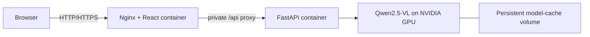

# Deploy the Full Application on AWS

This guide deploys both the React frontend and Qwen/FastAPI backend on one GPU
EC2 instance using Docker Compose. Nginx serves the frontend and forwards `/api`
to the backend over a private Docker network; only the frontend port is published.

AWS deployment is an alternative to the current Lightning AI demo. It uses the
same source and model implementation. Migration requires environment and
infrastructure changes, not Python or React rewrites.

## Deployment status

I have not deployed this project on AWS. AWS offers GPU EC2 instances such as
[`g4dn.xlarge`](https://docs.aws.amazon.com/ec2/latest/instancetypes/ac.html),
which includes an NVIDIA T4 GPU with 16 GiB of VRAM, but these GPU instances are
not included in the standard [EC2 Free Tier instance list](https://docs.aws.amazon.com/AWSEC2/latest/UserGuide/ec2-free-tier-usage.html).
Running the application on AWS would therefore consume account credits or incur
usage charges.

I deployed the complete frontend and backend on Lightning AI instead. At the time
of deployment, my Lightning AI account included up to 80 hours of free T4 GPU
usage with 16 GB of VRAM. This document describes the supported AWS deployment
path for future use; it does not claim that this project was deployed or tested on
AWS.

## Architecture on AWS



The backend is not published directly on the EC2 host. This keeps CORS disabled
for the standard AWS topology and gives the browser one origin.

## Requirements and cost gate

- Linux x86-64 EC2 with an NVIDIA GPU. The initial target is `g4dn.xlarge`:
  4 vCPU, 16 GiB host RAM, and one NVIDIA T4 with 16 GiB VRAM.
- Approximately 80 GiB gp3 storage for the OS, container layers, packages, and
  model cache. Measure and resize for the actual deployment.
- A supported Ubuntu GPU/Deep Learning AMI or Ubuntu with a working NVIDIA driver.
- AWS quota for at least four running On-Demand G/VT vCPUs in the chosen region.
- Docker Engine, Docker Compose plugin, and NVIDIA Container Toolkit.
- The repository or `business-card-lead-extractor-final.zip`.

GPU EC2 is paid compute and is not covered by ordinary micro-instance Free Tier.
Before launching, check the current regional price, credit eligibility/expiry,
GPU quota, EBS/public IPv4 costs, and configure AWS Budgets alerts. Stop the EC2
instance when the demo ends; retained EBS volumes and public IP resources can
continue to incur charges.

## 1. Launch EC2

In the EC2 console:

1. Choose a price- and quota-verified region.
2. Launch a GPU-compatible Ubuntu 22.04/24.04 or AWS Deep Learning AMI.
3. Select `g4dn.xlarge` initially.
4. Allocate approximately 80 GiB gp3 storage and review delete-on-termination.
5. Require IMDSv2.
6. Allow SSH port 22 only from the operator's IP.
7. Keep ports 8000 and 8080 closed publicly.
8. Add port 80, and later 443, only after loopback validation passes.

Connect from the operator machine:

```bash
chmod 400 /secure/path/business-card-app-key.pem
ssh -i /secure/path/business-card-app-key.pem ubuntu@EC2_PUBLIC_IP
```

Windows users can use `ssh.exe` with the Windows key path and restrict the key
through its Security properties.

## 2. Verify the GPU and install Docker

All remaining commands run on EC2.

```bash
nvidia-smi
```

Stop if the GPU is missing. A CUDA Python wheel does not replace the host NVIDIA
driver. If Docker is not already included by the AMI, install it from Docker's
official Ubuntu repository:

```bash
sudo apt-get update
sudo apt-get install -y ca-certificates curl gnupg git unzip
sudo install -m 0755 -d /etc/apt/keyrings
sudo curl -fsSL https://download.docker.com/linux/ubuntu/gpg -o /etc/apt/keyrings/docker.asc
sudo chmod a+r /etc/apt/keyrings/docker.asc
. /etc/os-release
printf 'Types: deb\nURIs: https://download.docker.com/linux/ubuntu\nSuites: %s\nComponents: stable\nArchitectures: %s\nSigned-By: /etc/apt/keyrings/docker.asc\n' \
  "$VERSION_CODENAME" "$(dpkg --print-architecture)" | \
  sudo tee /etc/apt/sources.list.d/docker.sources
sudo apt-get update
sudo apt-get install -y docker-ce docker-ce-cli containerd.io docker-buildx-plugin docker-compose-plugin
sudo systemctl enable --now docker
sudo usermod -aG docker "$USER"
```

Log out and reconnect so the Docker group applies. The Docker group grants
administrative-level host access; add only the intended operator.

Install NVIDIA Container Toolkit from NVIDIA's official repository if the AMI
does not already provide a configured runtime:

```bash
curl -fsSL https://nvidia.github.io/libnvidia-container/gpgkey | \
  sudo gpg --dearmor -o /usr/share/keyrings/nvidia-container-toolkit-keyring.gpg
curl -fsSL https://nvidia.github.io/libnvidia-container/stable/deb/nvidia-container-toolkit.list | \
  sed 's#deb https://#deb [signed-by=/usr/share/keyrings/nvidia-container-toolkit-keyring.gpg] https://#g' | \
  sudo tee /etc/apt/sources.list.d/nvidia-container-toolkit.list
sudo apt-get update
sudo apt-get install -y nvidia-container-toolkit
sudo nvidia-ctk runtime configure --runtime=docker
sudo systemctl restart docker
```

Validate the toolchain:

```bash
docker version
docker compose version
docker run --rm --runtime=nvidia --gpus all ubuntu:24.04 nvidia-smi
```

Consult the current [Docker Ubuntu instructions](https://docs.docker.com/engine/install/ubuntu/)
and [NVIDIA Container Toolkit guide](https://docs.nvidia.com/datacenter/cloud-native/container-toolkit/latest/install-guide.html)
if repository commands have changed.

## 3. Transfer the source

Using Git (authenticate with an account that has access to the private repository):

```bash
git clone https://github.com/Ayushman281/Business-Card-Extractor.git business-card-lead-extractor
cd business-card-lead-extractor
```

Or upload the final ZIP with `scp`, then:

```bash
unzip business-card-lead-extractor-final.zip
cd business-card-lead-extractor
```

The source package must not contain `.env`, credentials, private cards, model
weights, caches, or generated reports.

## 4. Configure the application

```bash
cp .env.example .env
nano .env
```

Use this initial AWS configuration:

```dotenv
EXECUTION_TARGET=aws
ENABLE_MODEL_INFERENCE=true
MODEL_ID=Qwen/Qwen2.5-VL-3B-Instruct
MODEL_REVISION=66285546d2b821cf421d4f5eb2576359d3770cd3
MODEL_DTYPE=auto
BACKEND_HOST=0.0.0.0
BACKEND_PORT=8000
CORS_ORIGINS=[]
ENABLE_API_DOCS=false
API_BASE_URL=
API_PROXY_URL=http://backend:8000
HTTP_BIND=127.0.0.1
HTTP_PORT=8080
```

Keep API docs disabled for public production-style deployment. Do not add AWS
credentials: the application only needs outbound access to download the public
model files.

Run preflight and validate Compose:

```bash
bash scripts/aws-preflight.sh --aws-only
docker compose config --quiet
```

## 5. Run tests and build both applications

```bash
docker compose -f compose.test.yml run --build --rm tests
docker compose build
```

The test image excludes PyTorch and Qwen. The production backend image installs
the pinned CUDA stack; the frontend build performs TypeScript checking and the
Vite production build.

Confirm the backend image can access CUDA before model startup:

```bash
docker compose run --rm --no-deps --entrypoint python backend -c \
  'import torch; assert torch.cuda.is_available(); print(torch.cuda.get_device_name(0))'
```

Stop and investigate any failure before enabling public access.

## 6. Start the full stack

```bash
docker compose up -d
docker compose ps
docker compose logs --tail=100 backend
```

The first backend start downloads and initializes the pretrained checkpoint in
the persistent `model-cache` volume. Check health from the EC2 host:

```bash
curl -fsS http://127.0.0.1:8080/api/health
curl -fsS http://127.0.0.1:8080/api/ready
```

Readiness returns 503 during model loading. Wait for:

```json
{ "ready": true }
```

Only one backend worker is configured. Do not start a separate proof-of-concept
model while the API is holding GPU memory.

## 7. Run real-model smoke validation

```bash
docker compose exec backend python scripts/generate_samples.py --aws-only
docker compose exec backend python scripts/aws_smoke.py --aws-only
mkdir -p outputs
docker compose cp backend:/tmp/smoke-report.json outputs/smoke-report.json
docker compose cp backend:/tmp/smoke-report.xlsx outputs/smoke-report.xlsx
```

Expected behavior: three fictional images extract successfully, one corrupt file
fails independently, edited values appear in the XLSX, and the workbook structure
is valid. Open the workbook and manually review every field; automated structure
checks do not establish extraction accuracy.

Check resource usage:

```bash
nvidia-smi
docker stats --no-stream
docker compose images
docker compose logs --tail=200 backend
```

## 8. Make the application public

After loopback checks pass, change only these `.env` values for a temporary HTTP
demonstration:

```dotenv
HTTP_BIND=0.0.0.0
HTTP_PORT=80
```

Recreate the frontend container so the published port changes:

```bash
docker compose up -d --force-recreate frontend
```

Allow inbound TCP 80 in the EC2 security group and open:

```text
http://EC2_PUBLIC_IP/
```

Keep port 8000 closed. Nginx serves React and forwards `/api` internally.
`API_BASE_URL` remains empty and `CORS_ORIGINS=[]` because browser requests are
same-origin.

For HTTPS, use a domain you control, an A/AAAA record, and a host reverse proxy
or managed load balancer with a certificate. Keep Compose on
`127.0.0.1:8080`, proxy to that address, preserve the 210 MiB request allowance,
disable request buffering for uploads, and use suitable 300-second API timeouts.
Follow current Certbot/ACM instructions for the chosen topology.

## Operations

Useful commands:

```bash
docker compose ps
docker compose logs -f backend
docker compose logs -f frontend
docker compose restart backend
docker compose up -d --build
docker compose down
```

After a backend restart, wait for readiness. Jobs do not survive restarts; model
weights should remain in the named cache volume. `docker compose down -v` deletes
that cache and forces a new model download, so use it only for intentional cleanup.

## Troubleshooting

| Symptom                      | Resolution                                                                                      |
| ---------------------------- | ----------------------------------------------------------------------------------------------- |
| Model state is disabled      | Check both `EXECUTION_TARGET=aws` and `ENABLE_MODEL_INFERENCE=true`, then recreate the backend. |
| CUDA unavailable             | Check host `nvidia-smi`, NVIDIA Container Toolkit, Docker runtime, and Compose GPU reservation. |
| Download returns 401/403/404 | Verify the exact model ID/revision and outbound network access; do not silently change models.  |
| Cache permission failure     | Inspect the `model-cache` volume ownership; the runtime user is UID/GID 10001.                  |
| GPU out of memory            | Stop competing GPU processes and ensure only one backend model instance is active.              |
| HTTP 429                     | Another batch is active or Nginx rate-limited requests; wait before retrying.                   |
| HTTP 413                     | Reduce individual or total upload size.                                                         |
| Public page unreachable      | Check the EC2 public address, security group, `HTTP_BIND`, container state, and port conflicts. |
| Job returns 404              | The result expired or the backend restarted; upload again.                                      |

## Shutdown and cleanup

`docker compose down` stops containers but does not stop EC2 billing. Stop the
instance in the EC2 console when the demo window ends. When the assessment is
over, terminate unused instances and inspect every region for retained EBS
volumes, snapshots, Elastic IPs, and other resources. Review Billing/Cost Explorer
after cleanup.

For implementation details and design tradeoffs, see
[the architecture document](../docs/architecture.md).
